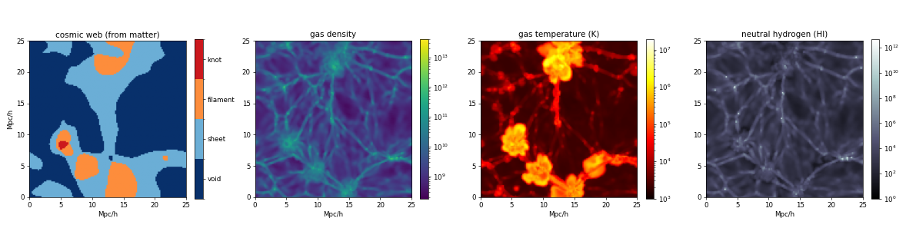

# Cosmic Web Mapper

Map the cosmic web — voids, sheets, filaments, and knots — and characterize *what fills them*, learning to reconstruct the structure from sparse, galaxy-like tracers with a 3D U-Net. Built on real simulation data from the [CAMELS Multifield Dataset](https://camels-multifield-dataset.readthedocs.io/), downloaded over plain HTTP (no login, no Globus).



## What it does

- **Classifies the cosmic web** from a density field with the tidal-tensor (T-web) method — each voxel is labeled void / sheet / filament / knot by counting the eigenvalues of the tidal tensor above a threshold.
- **Recovers the web from sparse tracers** — a 3D U-Net reconstructs the full classification from a Poisson-sampled, galaxy-survey-like view of the matter.
- **Characterizes void contents** — the same aligned grids carry gas density, temperature, neutral hydrogen, and more, so the map reports *what is in* each environment, not just its class.
- **Reconstructs hidden fields** — a multi-head model predicts the web *and* the gas / temperature / HI from tracers alone, addressing the observational reality that the full mass-and-gas distribution inside voids is not directly measurable.

### What is in each environment (real IllustrisTNG data, z = 0)

| environment | volume | gas vs. mean | median T | share of HI |
|---|---|---|---|---|
| void | 44% | 0.11× | ~2,300 K | 4% |
| sheet | 39% | 0.19× | ~3,600 K | 31% |
| filament | 16% | 0.63× | ~153,000 K | 47% |
| knot | 1.2% | 7.7× | ~891,000 K | 17% |

Voids are not empty — they hold diffuse *cold* gas; the warm-hot medium (WHIM) ignites in filaments and knots.

## Repository layout

```
cosmicweb/     reusable library — T-web, models, data access, training, plotting
scripts/       command-line entry points (download, analyze, train)
notebooks/     narrative walkthrough: foundations -> real data -> scaling -> multifield
assets/        result figures
docs/          supplementary references
```

## Install

```bash
git clone https://github.com/Dr-pm-dav/Cosmic_Web.git
cd cosmic-web-mapper
python -m venv .venv && source .venv/bin/activate      # Windows: .venv\Scripts\activate

pip install -e .
# then install the PyTorch build for your machine:
#   CPU:  pip install torch --index-url https://download.pytorch.org/whl/cpu
#   GPU:  pip install torch --index-url https://download.pytorch.org/whl/cu121   (match your CUDA)
```

Check the GPU is visible (optional): `python -c "import torch; print(torch.cuda.is_available())"`

## Quickstart

```bash
# fetch the CAMELS grids (~1 GB, cached locally, git-ignored)
python scripts/download_data.py

# measure what is in the cosmic web
python scripts/void_contents.py

# train the web classifier and print held-out test metrics
python scripts/train_web.py
```

Or work through the notebooks in order for the full story:

```bash
jupyter lab notebooks/
```

Using the library directly:

```python
import cosmicweb as cw

cw.download(cw.cmd_url("Mtot", folder="Nbody", tag="Nbody_IllustrisTNG"), "cmd.npy")
rho   = cw.load_grid("cmd.npy", 0)              # one realization, 128^3
web   = cw.tidal_web(cw.smooth(cw.to_overdensity(rho), 25.0, 1.0), 25.0)
print(dict(zip(cw.WEB_NAMES, cw.web_fractions(web).round(3))))
```

## Data

All grids come from the CAMELS Multifield Dataset (CV set — the IllustrisTNG hydro suite and its paired N-body run), 128³ voxels on a periodic 25 Mpc/h box at z = 0. `cosmicweb.cmd_url` builds the URLs and `scripts/download_data.py` fetches them. **Data is not committed to git** — it is re-downloadable and excluded via `.gitignore`.

## Notes & roadmap

- Accuracy on real data is honestly below toy fields; real structure is harder. More realizations, the built-in cube-symmetry augmentation, and a GPU close the gap.
- The multifield model is **extensible**: add a field to the registry to reconstruct a new layer (magnetic field, electron density, or a real survey map such as a 21 cm HI map).
- Next directions: cross-check voids against VIDE / DisPerSE catalogs; use the CAMELS LH set (1,000 cosmologies) to turn the pipeline into cosmological parameter inference; scale up to QUIJOTE's 1 Gpc boxes.

## Acknowledgments

Data from the [CAMELS](https://www.camel-simulations.org/) project. Void-cosmology motivation: Bromley & Geller, *Cosmology with voids* ([arXiv:2407.03882](https://arxiv.org/abs/2407.03882)).

## License

MIT — see [LICENSE](LICENSE).
